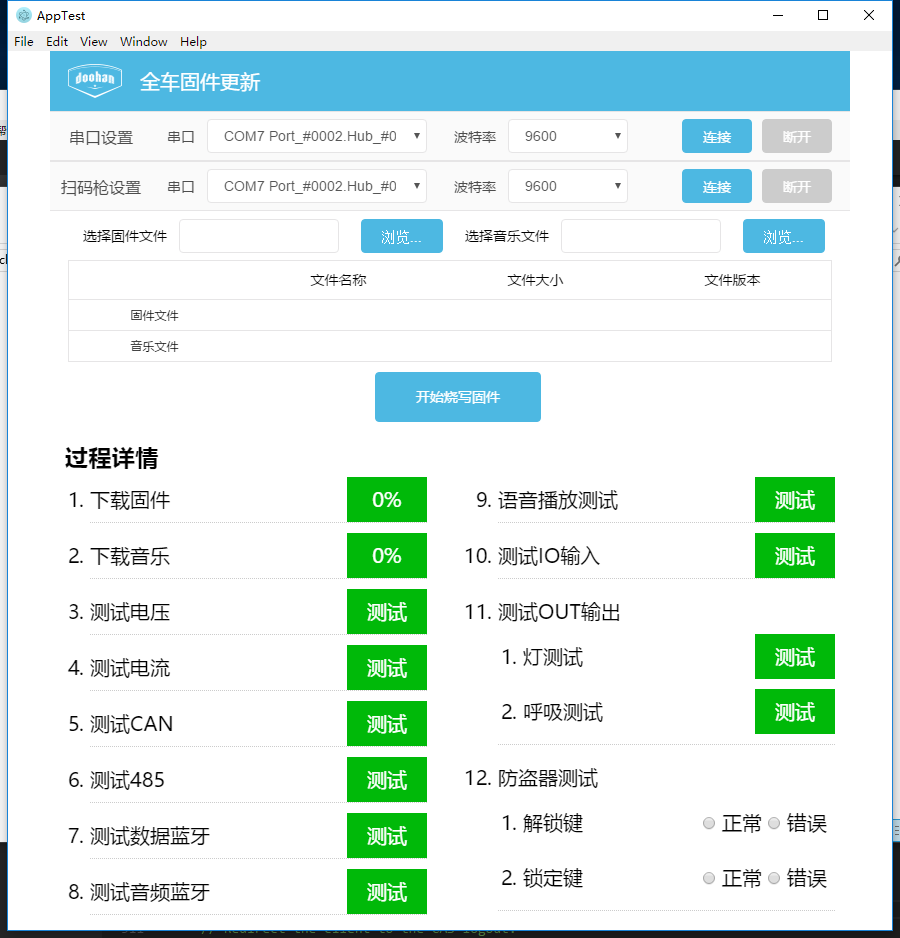

### electron
>2016.12月底，来到新公司，来的时候不是我想的那样，用express或者koa框架写一套东东，大boss说我要你做一个电脑软件。excuse me ?我勉强算是一个node工程师，你让我做这个，这尼玛不应该是安卓或ios做的吗？但是我该想问点问题时，boss说，钉钉就是这么做的，我不要求你做的跟钉钉一样，能用就行。瞬间我刚刚丢失的自信心回来了1%。没办法了，只能赶鸭子上架了。

>查资料，发现钉钉竟然也是用nw写的，当时我就感觉：哇，路还很长很长。去知乎逛了一圈，看到了nw和electron这两个东西，在逛得过程中发现知乎上的小伙伴们对electron青睐有加，我一个小白只好随大流了，没办法找资料，慢慢来吧

>从零到一的过程确实是挺爽的，从`hello word`开始到最后的成品，虽然不是什么大的东西，但毕竟是自己做出来的，还是挺有成就感的

> 话不多说，上图

